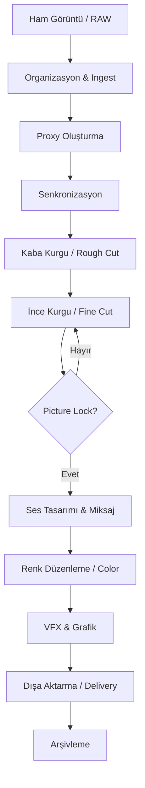

# ⚙️ Post-Prodüksiyon İş Akışı

> Profesyonel bir kurgu süreci, karman çorman bir zaman çizelgesinden (timeline) kaçınmak için sistematik aşamalardan oluşur. Her aşama bir sonrakinin temelini oluşturur.

---

## 🗺️ İş Akışı Şeması (Post-Production Lifecycle)



---

## 📁 1. Organizasyon ve Ingest

İyi bir kurgu, iyi bir organizasyonla başlar. **"Organize olmak zaman kaybettirir" değil, "organize olmamak daha fazla zaman kaybettirir."**

### Önerilen Klasör Hiyerarşisi

```
Proje_Adı/
├── 01_RAW_FOOTAGE/       # Ham kamera görüntüleri (asla silme!)
│   ├── Day_01/
│   └── Day_02/
├── 02_AUDIO/             # Harici ses kayıtları, müzikler
│   ├── Dialogue/
│   ├── SFX/
│   └── Music/
├── 03_GRAPHICS/          # Logolar, motion graphics, alt yazılar
├── 04_EXPORTS/           # Çıktı dosyaları (farklı formatlarda)
│   ├── Review_Cuts/
│   └── Final/
└── 05_PROJECT_FILES/     # .prproj, .drp, .fcpx dosyaları
```

### 🏷️ Dailies ve Metadata
Çekimlerin yapıldığı günün sonunda görüntülerin kontrol edilmesi sürecine **Dailies** denir.
- **Log Sheet:** Çekim sırasında tutulan notlarla görüntüleri eşleştirin.
- **Metadata:** Kurgu yazılımı içinde (Premiere Metadata veya Resolve Metadata) çekimlere "Good Take", "Must Use" gibi etiketler ekleyerek arama sürecini hızlandırın.

### Kural: 3-2-1 Yedekleme
- **3** kopya bulundur.
- **2** farklı medyada (örn: HDD + SSD).
- **1** tanesini farklı fiziksel konumda (bulut veya offsite).

---

## 🖥️ 2. Proxy Oluşturma (Proxy Workflow)

4K/6K/8K çekimler düzenleme yaparken sistemi yavaşlatır. **Proxy**, ham görüntünün düşük çözünürlüklü kopyasıdır.

| Format      | Proxy Çözünürlüğü | Önerilen Codec |
|-------------|-------------------|----------------|
| 4K (3840x2160) | 1920x1080 | ProRes Proxy / DNxHD LB |
| 6K / 8K     | 1280x720 | ProRes 422 LT |

> **💡 İpucu:** DaVinci Resolve, Premiere Pro ve Final Cut Pro proxy iş akışlarını otomatik yönetebilir. Export aşamasında orijinal kaliteli dosyaya geri döner.

---

## 🔗 3. Senkronizasyon (Syncing)

Harici ses kaydediciler (Zoom H6, Sound Devices gibi) kullanıldığında ses ve görüntünün eşleştirilmesi gerekir.

**Yöntemler:**
1. **Klap tahtası (Slate):** Fiziksel klap sesi ve görüntüsüyle elle sync alma.
2. **Waveform Matching:** Yazılımın ses dalgalarını karşılaştırarak otomatik eşleştirmesi.
3. **Timecode:** Profesyonel setlerde kamera ve ses cihazlarını aynı timecode'a bağlama (Tentacle Sync vb.).

---

## ✂️ 4. Kurgu Aşamaları (Assembly to Fine Cut)

1.  **Assembly Cut:** Senaryo sırasına göre tüm çekimlerin dizilmesi.
2.  **Rough Cut:** Hikayenin ham iskeleti. Mükemmellik aranmaz.
3.  **Fine Cut:** Ritim, nefes ve tempo bu aşamada şekillenir.
    - **Pacing:** Sahnenin hızı duygusal tonla uyumlu hale getirilir.

---

## 🔒 5. Kilit (Picture Lock)

**En kritik aşamalardan biri.** Görüntü kurgusunun tamamlanıp onaylandığı nokta.

> ⚠️ **Uyarı:** Picture Lock sonrası herhangi bir kesme yapılırsa ses tasarımı ve renk çalışması "out of sync" olur. Bu süreci mutlaka yöneticiden onay alarak resmileştirin.

---

## 🔄 6. Round-Tripping (Conforming)

Profesyonel projelerde kurgu Premiere'de yapılıp renk için Resolve'a gönderilir. Buna **Round-tripping** denir.

**İş Akışı:**
1. **Premiere'den Export:** Timeline'ı basitleştirin (sadece video trackleri kalsın), `XML` veya `AAF` olarak export edin.
2. **Resolve'a Import:** XML dosyasını import ederek orijinal medya dosyalarına linkleyin (**Conforming**).
3. **Color Grading:** Renk işlemleri tamamlanır.
4. **Geri Dönüş:** Render alıp (yine XML ile) Premiere'e geri dönün veya final render'ı Resolve'dan yapın.

---

## 📦 7. Arşivleme ve Teslimat

İş bittiğinde projeyi "dondurmak" gerekir.
- **Media Management:** Sadece kullanılan klipleri (artı birkaç saniyelik pay - handles) yeni bir disk konumuna kopyalayın.
- **Project Consolidation:** Kullanılmayan terabaytlarca ham veriyi silmeden önce projenin bağımsız bir kopyasını oluşturun.

---

[🏠 README'ye Dön](../README.md)
