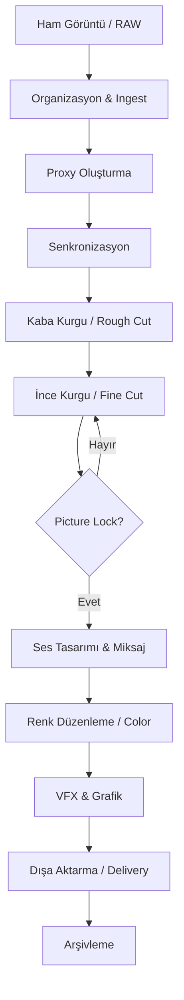

# ⚙️ Post-Prodüksiyon İş Akışı

> Profesyonel bir kurgu süreci, karman çorman bir zaman çizelgesinden (timeline) kaçınmak için sistematik aşamalardan oluşur. Her aşama bir sonrakinin temelini oluşturur.

---

## 🗺️ İş Akışı Şeması (Post-Production Lifecycle)



---

## 📁 1. Organizasyon ve Ingest

İyi bir kurgu, iyi bir organizasyonla başlar. **"Organize olmak zaman kaybettirir" değil, "organize olmamak daha fazla zaman kaybettirir."**

### 🛡️ Veri Güvenliği (Ingest & Checksum)
Ham görüntüleri karta aktarırken bas sürükle-bırak yöntemi risklidir. Profesyonel projelerde **Checksum** (MD5 veya XXH64) doğrulama yapan yazılımlar (Hedge, Silverstack, DaVinci Resolve Clone Tool) kullanılmalıdır. Bu, verinin kopyalanırken bozulmadığını matematiksel olarak kanıtlar.

### Önerilen Klasör Hiyerarşisi
(Aynı yapı korunmuştur...)
```
Proje_Adı/
├── 01_RAW_FOOTAGE/       # Ham kamera görüntüleri (asla silme!)
│   ├── Day_01/
│   └── Day_02/
├── 02_AUDIO/             # Harici ses kayıtları, müzikler
│   ├── Dialogue/
│   ├── SFX/
│   └── Music/
├── 03_GRAPHICS/          # Logolar, motion graphics, alt yazılar
├── 04_EXPORTS/           # Çıktı dosyaları (farklı formatlarda)
│   ├── Review_Cuts/
│   └── Final/
├── 05_PROJECT_FILES/     # .prproj, .drp, .fcpx dosyaları
└── 06_TURNOVERS/         # Diğer departmanlar için hazırlanan dosyalar (EDL, XML, AAF)
```

---

## 🏗️ 1.5. Donanım ve Çalışma Alanı (Hardware Setup)

Kurgu sırasında tıkanıklıkları (bottleneck) önlemek için disk yönetimi kritiktir:
- **OS/Apps Drive:** İşletim sistemi ve programlar için hızlı bir NVMe SSD.
- **Media Drive (RAID):** Görüntülerin durduğu alan. 4K+ projelerde **RAID 0** (hız için) veya **RAID 5** (güvenlik + hız) önerilir.
- **Scratch/Cache Drive:** Yazılımların geçici dosyaları (render files, peak files) için ayrı bir SSD. Bu, ana diskin performansını korur.

---

## 🖥️ 2. Proxy Oluşturma (Proxy Workflow)

4K/6K/8K çekimler düzenleme yaparken sistemi yavaşlatır. **Proxy**, ham görüntünün düşük çözünürlüklü kopyasıdır.

| Yazılım | Önerilen Proxy Ayarı | Codec |
|---------|---------------------|-------|
| **Premiere Pro** | 1280x720 ProRes Proxy | QuickTime (.mov) |
| **DaVinci Resolve** | Half Res / Quarter Res | ProRes 422 LT / DNxHR LB |
| **Final Cut Pro** | 50% Size | ProRes Proxy |

> **💡 İpucu:** Proxy oluştururken "Burn-in" (dosya adı ve timecode'un görüntü üzerine yazılması) tercih edilebilir. Bu, kurgu sırasında hangi dosya ile çalıştığınızı anlık görmenizi sağlar.

---

## 🔗 3. Senkronizasyon (Syncing)

Harici ses kaydediciler kullanıldığında ses ve görüntünün eşleştirilmesi gerekir.

**Yöntemler:**
1. **Klap tahtası (Slate):** Fiziksel klap sesi ve görüntüsüyle elle sync alma. En güvenilir yöntemdir.
2. **Waveform Matching:** Yazılımın ses dalgalarını karşılaştırarak otomatik eşleştirmesi. Rüzgarlı veya gürültülü ortamlarda hata payı yüksektir.
3. **Timecode (LTC):** Profesyonel setlerde kamera ve ses cihazlarını aynı timecode'a bağlama. Post-prodüksiyonda saniyeler içinde binlerce klibi eşleştirmenizi sağlar.

---

## ✂️ 4. Kurgu Aşamaları (Assembly to Fine Cut)

1.  **Assembly Cut:** Senaryo sırasına göre tüm çekimlerin dizilmesi.
2.  **Rough Cut:** Hikayenin ham iskeleti. Mükemmellik aranmaz, sadece akış kontrol edilir.
3.  **Fine Cut:** Ritim, nefes ve tempo bu aşamada şekillenir.
    - **Pacing:** Sahnenin hızı duygusal tonla uyumlu hale getirilir.
4. **Director's Cut / Producer's Cut:** Revizyon ve onay süreçleri.

---

## 🔒 5. Kilit (Picture Lock)

**En kritik aşamalardan biri.** Görüntü kurgusunun tamamlanıp onaylandığı nokta.

> ⚠️ **UYARI:** Picture Lock sonrası herhangi bir kare ekleme/çıkarma yapılırsa ses tasarımı ve renk çalışması "out of sync" olur. Buna **"VFX/Sound Breakdown"** denir.

---

## 🔄 6. Round-Tripping (Conforming)

Profesyonel projelerde kurgu Premiere'de yapılıp renk için Resolve'a gönderilir.

**İş Akışı Detayı:**
1. **Prepare Timeline:** Tüm efektleri, geçişleri ve üst üste binmiş trackleri temizleyin. Timeline mümkün olduğunca "flat" (tek bir video track) olmalıdır.
2. **Export XML/AAF:** Premiere'den FCP XML veya AAF olarak export alın.
3. **Relinking in Resolve:** Resolve'da XML'i açarken "Mixed Frame Rates" ve "Resolution" ayarlarının orijinal projeyle aynı olduğundan emin olun.

---

## 👥 6.5. Ortak Çalışma (Collaborative Workflows)

Büyük projelerde birden fazla editör aynı anda çalışabilir:
- **Project Locking:** Bir kişi bir sequence'i açtığında diğerlerinin sadece "Read-Only" (salt okunur) görebilmesi.
- **Review Platforms:** Frame.io üzerinden müşterinin videonun tam üzerindeki saniyeye "Burası çok karanlık" diye not düşebilmesi süreci 3 kat hızlandırır.

---

## 📦 7. Arşivleme ve Teslimat

İş bittiğinde projeyi "dondurmak" gerekir.
- **Media Consolidation:** Sadece kullanılan klipleri (artı birkaç saniyelik pay - handles) yeni bir disk konumuna kopyalayın.
- **Project Archiving:** Proje dosyasını, fontları, kullanılan plugin listesini ve bir "Master Prores" kopyasını mutlaka saklayın.
- **LTO Tape:** Çok büyük prodüksiyonlarda (TV/Sinema) veriler 30+ yıl saklanabilen manyetik bantlara (LTO) yazılır.

---

[🏠 README'ye Dön](../README.md)
