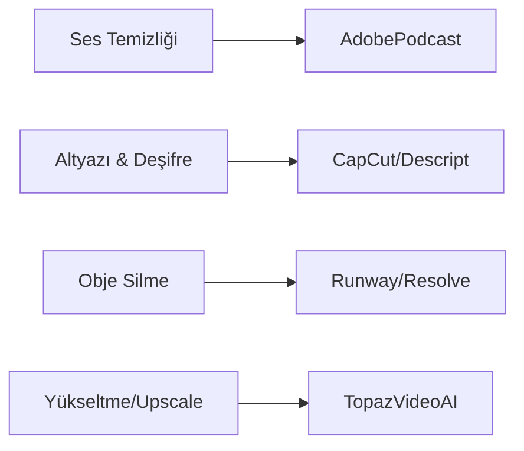

# 🤖 Yapay Zeka (AI) Entegrasyonları

> Kurgu dünyasında AI bir rakip değil, asistanınızdır. Rutin işleri (rotoskopi, deşifre, temizlik) AI'ya bırakıp, yaratıcılığa odaklanın.

---

## 📽️ Üretken Video (Generative Video)

2024 itibarıyla en güçlü araçlar:

| Araç | Yetenek | Durum |
|------|---------|-------|
| **Runway Gen-3 Alpha** | Metinden videoya ultra gerçekçi geçişler | ✅ Yayında |
| **Luma Dream Machine** | Fizik kurallarına çok yakın hareketler | ✅ Yayında |
| **Sora (OpenAI)** | Sinematik kalite ve uzun format | 🚧 Erken Erişim |
| **Kling AI** | 10 saniyelik tutarlı sahneler | ✅ Yayında |

---

## ⚡ Prodüksiyonu Hızlandıran AI Çözümleri

### 1. Akıllı Rotoskopi (Object Selection)
Daha önce kare kare yapılan maskeleme işlemi artık saniyeler sürüyor.
- **Runway Inpainting:** Videodan nesne silme.
- **DaVinci Magic Mask:** Karakteri arka plandan ayırıp bağımsız renk/efekt uygulama.
- **Premiere Pro Roto Brush 3.0:** İleri seviye nesne takibi.

### 2. Metin Tabanlı Kurgu (Text-Based Editing)
Videonun transkriptini (metnini) düzenleyerek kurgu yapma.
- **Premiere Pro:** Deşifre edilen metindeki duraklamaları (Filler words) tek tıkla siler.
- **Descript:** Metni sildiğinizde ilgili video karesi de silinir; podcast kurguları için "kutsal kase"dir.

### 3. AI Depth Mapping (Derinlik Haritalama)
2D bir videodan derinlik bilgisi çıkarıp, karakterin "arkasına" yazı veya efekt ekleme.
- **DaVinci Resolve Depth Map:** Sahneye sanal sis, ışık veya derinlik bazlı netlik (blur) ekler.

---

## 🎙️ Ses ve Dublaj AI

- **ElevenLabs:** İnanılmaz gerçekçi seslendirme ve **Dubbing Studio** (bir dildeki videoyu, orijinal ses karakterini bozmadan başka dile çevirme).
- **Topaz Video AI:** Düşük çözünürlüklü ve grenli görüntüleri "denoise" ederek parlatır, kare hızını (Frame Rate) artırır (Super Slow Motion).
- **Adobe Firefly:** Photoshop'taki Generative Fill özelliğini video arka planları için kullanma veya metinden doku üretme.

---

## 🏗️ AI-Native Kurgu İş Akışı (Örnek)

AI araçlarını birbirine bağlayarak üretim hızınızı 10 katına çıkarabilirsiniz:
1.  **Senaryo:** ChatGPT / Claude ile hikaye iskeleti oluşturma.
2.  **Ses:** ElevenLabs ile seslendirme.
3.  **Görsel:** Midjourney ile konsept görseller üretip Runway Gen-3 ile videoya çevirme.
4.  **Kurgu:** Descript veya Premiere ile metin üzerinden hızlı kesim.
5.  **Cilalama:** Topaz Video AI ile 4K yükseltme ve netleştirme.

---

## ⚖️ AI Etiği ve Gelecek

Yapay zeka kullanımı artarken şunlara dikkat edilmelidir:
1. **İçerik Etiketleme:** YouTube ve TikTok, AI ile üretilen veya manipüle edilen içeriklerin (özellikle gerçekçi olanlar) "AI Generated" olarak etiketlenmesini zorunlu kılmıştır.
2. **Derin Sahtecilik (Deepfake):** İzin alınmadan kişilerin sesini veya görüntüsünü kullanmak etik dışıdır ve birçok ülkede suç teşkil eder.
3. **Kreatif Kontrol:** AI'yı bir "başlatıcı" olarak kullanın, ancak son sanatsal kararı her zaman siz verin.

---

## 🛠️ AI Başlangıç Seti

---

[🏠 README'ye Dön](../README.md)
