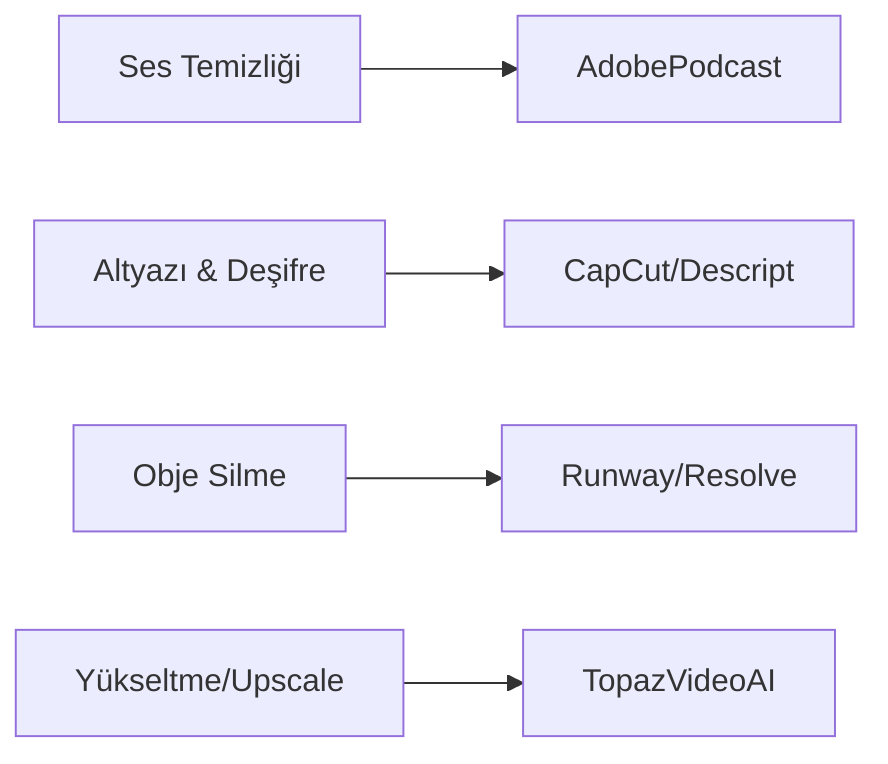

# 🤖 Yapay Zeka (AI) Entegrasyonları

> Kurgu dünyasında AI bir rakip değil, asistanınızdır. Rutin işleri (rotoskopi, deşifre, temizlik) AI'ya bırakıp, yaratıcılığa odaklanın.

---

## 📽️ Üretken Video (Generative Video)

2024 itibarıyla en güçlü araçlar:

| Araç | Yetenek | Durum |
|------|---------|-------|
| **Runway Gen-3 Alpha** | Metinden videoya ultra gerçekçi geçişler | ✅ Yayında |
| **Luma Dream Machine** | Fizik kurallarına çok yakın hareketler | ✅ Yayında |
| **Sora (OpenAI)** | Sinematik kalite ve uzun format | 🚧 Erken Erişim |
| **Kling AI** | 10 saniyelik tutarlı sahneler | ✅ Yayında |

---

## ⚡ Prodüksiyonu Hızlandıran AI Çözümleri

### 1. Akıllı Rotoskopi (Object Selection)
Daha önce kare kare yapılan maskeleme işlemi artık saniyeler sürüyor.
- **Runway Inpainting:** Videodan nesne silme.
- **DaVinci Magic Mask:** Karakteri arka plandan ayırıp bağımsız renk/efekt uygulama.
- **Premiere Pro Roto Brush 3.0:** İleri seviye nesne takibi.

### 2. Metin Tabanlı Kurgu (Text-Based Editing)
Videonun transkriptini (metnini) düzenleyerek kurgu yapma.
- **Premiere Pro:** Deşifre edilen metindeki duraklamaları (Filler words) tek tıkla siler.
- **Descript:** Metni sildiğinizde ilgili video karesi de silinir; podcast kurguları için "kutsal kase"dir.

### 3. AI Depth Mapping (Derinlik Haritalama)
2D bir videodan derinlik bilgisi çıkarıp, karakterin "arkasına" yazı veya efekt ekleme.
- **DaVinci Resolve Depth Map:** Sahneye sanal sis, ışık veya derinlik bazlı netlik (blur) ekler.

---

## 🎙️ Ses ve Dublaj AI

- **ElevenLabs:** İnanılmaz gerçekçi seslendirme ve **Dubbing Studio** (bir dildeki videoyu, orijinal ses karakterini bozmadan başka dile çevirme).
- **Topaz Video AI:** Düşük çözünürlüklü ve grenli görüntüleri "denoise" ederek parlatır, kare hızını (Frame Rate) artırır (Super Slow Motion).
- **Adobe Firefly:** Photoshop'taki Generative Fill özelliğini video arka planları için kullanma veya metinden doku üretme.

---

## 🚀 Üretken Video (Generative Video) 2024-2025

Kurguda artık sadece mevcut görüntüyü düzenlemek değil, yeni görüntüler yaratmak da mümkün:

| Araç | Kullanım Alanı | Özellik |
|------|---------------|----------|
| **Luma Dream Machine** | Video Üretimi | Gerçekçi hareketler ve yüksek tutarlılık. |
| **Runway Gen-3 Alpha** | Video Üretimi | Sinematik kalite ve detaylı kontrol (Motion Brush). |
| **Kling AI** | Video Üretimi | 2 dakikaya kadar tutarlı video üretimi. |
| **Sora (OpenAI)** | Video Üretimi | Karmaşık sahneler ve fizik kurallarına uyum. |

---

## 🛠️ Kurguda AI Destekli İş Akışları

AI, sıkıcı ve zaman alan işleri saniyelere indiriyor:

1.  **AI Rotoscoping:** DaVinci Resolve **Magic Mask** ile bir nesneyi arka plandan ayırmak için kare kare boyama yapmaya gerek kalmadı.
2.  **Voice Isolation:** Kayıttaki dip gürültüsünü ve yankıyı silip stüdyo kalitesine (Adobe Podcast Enhance vb.) getirme.
3.  **Text-Based Editing:** Videoyu bir Word belgesi gibi düzenleme. Cümleyi sildiğinizde video da otomatik kesilir (Descript, Premiere Pro).
4.  **Auto-Reframe:** 16:9 yatay bir videoyu otomatik olarak 9:16 dikey (TikTok/Reels) formatına dönüştürüp konuyu merkezde tutma.
5.  **Generative Fill:** Videodaki istenmeyen bir nesneyi (örn: bir kablo veya mikrofon) otomatik söküp yerine doku ekleme.

---

## ⚖️ AI Etiği ve Gelecek

Kurgu dünyası AI ile dönüşürken şu noktalar önem kazanıyor:
- **Telif Hakları:** AI tarafından üretilen görsellerin telif durumu hala gri bir alandadır.
- **Deepfake Riski:** Kişilerin rızası olmadan görüntülerini kullanmak etik dışıdır ve hukuki yaptırımları vardır.
- **Yaratıcılık vs. Otomasyon:** AI bir araçtır, hikaye anlatıcının (editörün) vizyonunun yerini alamaz. Duygu ve tempo halen insan kontrolünde olmalıdır.

> **💡 İpucu:** AI'ı kurgu yapmak için değil, kurgunun hamallığını (transkripsiyon, temizlik, maskeleme) ona yaptırmak için kullanın.

---

## 🛠️ AI Başlangıç Seti

---

[🏠 README'ye Dön](../README.md)
